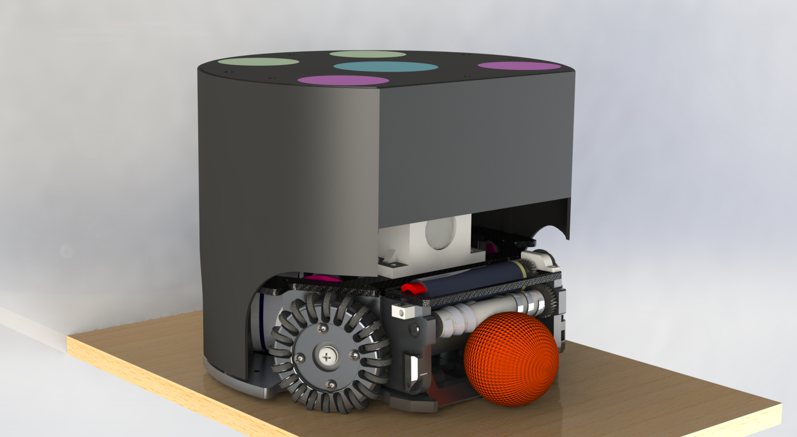

# Mechanics
>  ZJUNlict Mechanical Design in 2018 for the RoboCup Small Size League https://zjunlict.cn
>
> The mechanical design was designed with Solidworks 2019.

## Introduction

In 2018 we participated in the RoboCup SSL and won the championship luckily. This mechanical design is what we used in the match. We divide our robot into 4 parts according to their functions. There will be a brief introduction to each part next.

## BASE

This is the pedestal of the robot. The main parts of the base are "baseplate_2018" and "upperplate_2018". The material of "baseplate_2018" is aluminum alloy(7075/A97075 AA/UNS), which has a high intensity. The material of "upperplate_2018" is carbon fiber. The base has to be firm enough and not too heavy. So the choice of materials is very important.

## KICK SYS

This is the ball-kicking system including flat-kicking system and chip-kicking system. They are fixed to the "baseplate_2018" by "limit block" and "coil shelf". 

For the chip-kicking system, we change into the percussion-type from the connecting-rod-type to increase the shooting distance. Simultaneously, the percussion type puts forward higher requirements for the strength of the parts. So we design a integrated shovel "chip sholve_45"(in the "MOUTH" folder). The material of it is aluminum alloy(7075/A97075 AA/UNS). 

On the other side, the stability of the percussion type is not as good as connecting rod type. Because the collision model has more uncertainty. 

<table>
    <tr>
        <td >
Fig 1  Connecting Rod Type 
</td>
        <td >
Fig 2 Percussion Type
</td>
    </tr>
<table>

## MOTOR

We choose the 20-small-wheel wheel for our robot. In theory, the more small wheels it has, the more smooth motion performance it has. But once the small wheels are too many, it will be very hard to maintain. For example, cleaning up the dust in it. 

For the driving motor, we choose Maxon EC-45 50W. The encoder is US Digital E4T, 500 CPR. For more information please visit [ZJUNlict/Electronics](<https://github.com/ZJUNlict/Electronics>)

The reduction gearbox is designed for internal gear drive. The reduction ratio of it is 70:22. 

## MOUTH

The whole device has only one degree of freedom of rotation. We use a dribble motor(Maxon EC-16 30W) and a silicon tube to grab the ball. We have tested the dynamic dribbling ability using the silicon tube(shown in our [ ETDP in 2018 ](http:<https://zjunlict.cn/wp-content/uploads/2018/11/Small_Size_League_-_RoboCup_2018_-_TDP_ZJUNlict.pdf>)). Since 2018, we have changed the external reduction ratio of the dribbling motor to 1:1, setting the output power to a better value. 

Simultaneously, we designed threads in the surface of the silicon tube so that the tube can keep the ball in the center of the mouth. 

