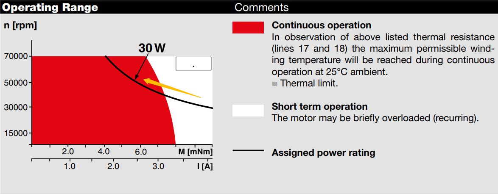

# Mechanics
>  ZJUNlict Mechanical Design in 2018 for the RoboCup Small Size League https://zjunlict.cn
>
> The mechanical design was designed with Solidworks 2019. You can edit the files only with Solidworks 2019 or higher version. If you don't have the software license, you can read the files with [eDrawings Viewer](<https://www.solidworks.com/sw/support/edrawings/e2_downloadcheck.htm>)(can not edit the files), which is free of charge.

## Introduction

In 2018 we participated in the RoboCup SSL and won the championship luckily. We divide our robot into 4 parts according to their functions. There will be a brief introduction to each part next. The overall rendering of our robot is shown in the photo below.

## BASE

The main parts of the base are "baseplate_2018" and "upperplate_2018". The material of "baseplate_2018" is aluminum alloy(7075/A97075 AA/UNS), which has a high specific strength. The material of "upperplate_2018" is carbon fiber. The selection of materials is based on their high specific strength.

## KICK SYS

The ball-kicking system includes flat-kicking system and chip-kicking system. They are fixed to the "baseplate_2018" by "limit block" and "coil shelf". 

Since 2016, we have changed our chip-kicking system from connecting-rod-type to percussion-type to increase shooting distance. Simultaneously, to meet the higher requirements for the strength of the parts, we design a integrated shovel "chip sholve_45"(in the "MOUTH" folder). The material of it is aluminum alloy(7075/A97075 AA/UNS). 

<table>
    <tr>
        <td >
Fig 1  Connecting Rod Type 
</td>
        <td >
Fig 2 Percussion Type
</td>
    </tr>
<table>

## MOTOR

We choose the 20-small-wheel wheel for our robot. In theory, the more small wheels it has, the more smooth motion performance it has. But54 once the small wheels are too many, it will be very hard to maintain such as cleaning up the dust in it. 

For the driving motor, we choose Maxon EC-45 50W. The encoder is US Digital E4T, 500 CPR. For more information please visit [ZJUNlict/Electronics](<https://github.com/ZJUNlict/Electronics>)

The reduction gearbox is designed for internal gear drive. The reduction ratio of it is 70:22. 

## MOUTH

The whole device has only one degree of freedom of rotation(see photo below). 

We use a dribbling motor(Maxon EC-16 30W) and a silicon tube to grab the ball. We have tested the dynamic dribbling ability using the silicon tube(shown in our [ ETDP in 2018 ](http:<https://zjunlict.cn/wp-content/uploads/2018/11/Small_Size_League_-_RoboCup_2018_-_TDP_ZJUNlict.pdf>)). Since 2018, we have changed the external reduction ratio of the dribbling motor to 1:1, setting the rotating speed of the dribbling motor to a more proper value and setting the output power of the motor closer to rated power. (According to [ Maxon catalog page](<https://www.maxonmotor.com/medias/sys_master/root/8825423364126/17-EN-212.pdf>), also shown in the photo below)

Simultaneously, we designed threads in the surface of the silicon tube so that the tube can keep the ball in the center of the mouth more easily.  The photo of the mouth is shown below.

